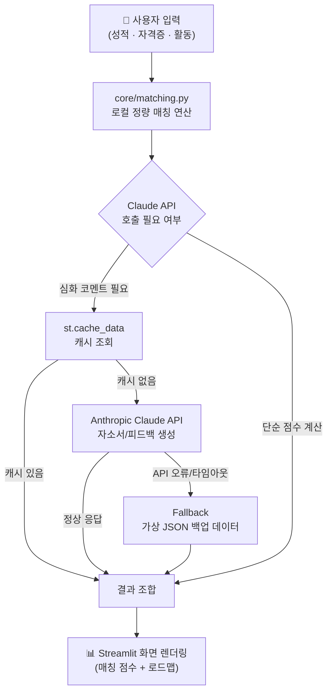

🛠️ AI Job Pass Finder
"학교에서 시장으로" — 마이스터의 등용문을 여는 AI 맞춤형 취업 파트너"

전북기계공업고등학교 팀 E.M.P (Employment Meister Partner)
Team: 김우빈(팀장·개발·기획), 김정수(문서·디자인), 오상명(영상·개발), 이건희(백엔드·데이터)

# Meister Job Pathfinder (AI Job Pass Finder) — 확장판

마이스터고 학생을 위한 취업 성공 AI JOB 패스파인더입니다.
**전북기계공고 E.M.P 팀**이 NAVER OGQ마켓 AI 공모전 출품을 위해 제작했습니다.

📌 1. 프로젝트 정의 및 필요성
"실력은 마이스터, 정보는 미스매치"

마이스터고 학생들은 우수한 실무 역량을 가졌음에도 자신의 5등급 성취평가제 내신과 자격증이 어떤 기업에 적합한지 스스로 판단하기 어렵습니다.

개인적 문제: 정보 비대칭으로 인한 스펙 준비 시간 낭비 및 취업 막막함.
사회적 문제: 학교·지역 간 정보 격차와 취업 미스매치로 인한 조기 이직 비용 발생.

해결책: AI 기술을 통해 학생의 데이터를 해석하고, 시장의 기회(기업)와 정밀하게 연결합니다.

이번 버전은 **하이파이브(전공/취업률) · 큐넷(자격증 가산점) · 캐치(기업분석 카드) ·
코멘토(4주 커리큘럼) · 링커리어(합격데이터 서사)** 5개 플랫폼의 데이터 구성 방식을
참고해 확장한 통합 MVP입니다.

🚀 2. 핵심 기능 (MVP)
① 마이스터고 특화 AI 스펙 매칭 시스템
전용 알고리즘: 5등급 성취평가제를 100점 만점으로 정밀 환산하고, 자격증 가산점을 결합하여 객관적인 **'취업 합격 지수'**를 산출합니다.
실시간 데이터 연동: 큐넷(Q-Net) API를 통해 자격증별 대기업/공기업 가산점 규정을 실시간 매핑합니다.

② 6대 공신력 포털 통합 검색 (Real-time Ecosystem)
통합 검색: 고용24, 잡알리오, '참 괜찮은 강소기업' 등 공공·민간 포털의 데이터를 실시간 스크래핑/연동하여 최신 공고를 한곳에 모았습니다.
데이터 안정성: 실시간 연동 실패 시 즉시 작동하는 20건의 고도화된 백업 데이터(Fallback) 시스템을 구축하여 중단 없는 서비스를 제공합니다.

③ AI 1:1 맞춤 컨설팅 및 자소서 자동 완성
개인화 피드백: Anthropic Claude를 활용하여 기업 인재상 대비 강점과 보완점을 분석한 리얼 컨설팅 리포트를 제공합니다.
이력서 자동 생성: 보유 자격증과 전공 프로젝트 경험을 비즈니스 언어로 변환하여 기업 맞춤형 자기소개서를 생성합니다.

④ NAVER OGQ 연계 시각화 로드맵
성취 스토리텔링: 자격증 취득부터 최종 합격까지의 여정을 네이버 OGQ 캐릭터 스티커와 스탬프를 활용해 게임화된 성취 경험으로 시각화했습니다.

⑤ 🔄 실시간 채용 공고 통합 검색 (고용24 + 잡알리오 + 강소기업)
2. 실시간 기업 탐색기 아래에 위치해 있으며 , 
고용24(민간·중소기업), 잡알리오(공기업), '참 괜찮은 강소기업' 포털 데이터를 함께 검색합니다. 
기계·전기·제조·IT 전공과 연관된 강소기업 공고는 우선적으로 상단에 노출됩니다.
고용 24 (민간 , 중소기업 , 잡알리오 (공기업) , '참 괜찮은 강소기업' 을 스크래핑하여 실시간 검색 값이 도출됩니다.

🤖 3. AI 활용 명세 
본 프로젝트는 기능별 최적화를 위해 멀티 AI 모델링 전략을 채택하였습니다.

모델명 : Anthropic Claude(Sonnet 5 / Opus 3) 
활용 분야 : 피드백 & 자소서 생성
선택 사유 및 기술 디테일 : 마이스터고 학생의 기술적 강점을 기업 인재상에 맞춰 전문 비즈니스 문장으로 치환하는 데 최적화됨.

모델명 : Gemini (3.1pro / 3.6 flash)
활용 분야 : 실시간 데이터 구조화
선택 사유 및 기술 디테일 : 큐넷·잡알리오에서 스크래핑한 비정형 공고 데이터를 매칭 알고리즘용 정형 JSON 데이터로 정밀 변환.

모델명 : Gemini Notebook
활용 분야 : 시스템 설계 파트너
선택 사유 및 기술 디테일 : 대회 가이드라인과 기술 스택을 통합 분석하여 시스템 아키텍처 설계 및 개발 우선순위(12단계) 의사결정 지원.

모델명 : 짓다 (Jidda / AI Writing Assistant)
활용 분야 : UX 보이스 앤 톤 강화
선택 사유 및 기술 디테일 : OGQ 캐릭터에 마이스터고 맞춤형 페르소나를 부여하여 친근한 응원 메시지 및 대사 생성.

 4. 기술 스택 및 구조
Frontend/Backend: Python, Streamlit
Scraping: BeautifulSoup4, Requests, xml.etree.ElementTree
Design: Figma (UX/UI 설계 및 프레임워크 구축)
Deployment: Streamlit Community Cloud


5. 윤리 및 안전 
🧪 데이터 투명성: 현재 MVP에서 제공하는 기업 상세 수치 및 후기 등은 알고리즘 검증을 위한 시스템 생성 예시 데이터이며, 이를 앱 곳곳에 명시하여 사용자의 오해를 방지했습니다.
저작권 준수: 사용된 모든 네이버 OGQ 자산은 대회 가이드라인을 준수하며, 공공 데이터는 공식 API 활용 지침에 따라 처리되었습니다.

🛠 6. 버그 수정 및 개선 이력 (Technical Completeness)
상태 유지 해결: st.multiselect 및 입력 위젯에 고유 key를 부여하여 다중 선택 시 데이터가 초기화되던 Streamlit 고유 버그를 해결했습니다.
검색 필터 고도화: 검색어 입력 시 백업 데이터 전체가 노출되던 로직을 filter_results() 함수로 정교화했습니다.


### 🛠 주요 버그 수정 이력
- **다중 선택 위젯 유실 버그**: '스펙 진단' 탭의 자격증/강점 키워드 `st.multiselect`에
  고유 `key`가 없어, 선택할 때마다 위젯 내부 식별자가 흔들려 이전 선택이 사라지는
  문제가 있었습니다. 모든 상태 저장 위젯(학과·등급·자격증·강점 키워드)에 명시적
  `key`를 부여해 해결했습니다.
- **탭2 검색 필터링 무시 버그**: 검색어를 입력해도 항상 백업 데이터 전체가 나오던
  문제를 `core/matching.py`의 `filter_results()` 함수로 수정했습니다.

---

---

## 🔑 스크래핑을 통한 데이터 신뢰성 확보 및 기업 맞춤형 AI 모델링

이 프로젝트가 신뢰성을 확보하는 방식은 다음 3단계입니다.

1. **공식 공공데이터는 실제 API 연동을 우선 시도**한다. (Q-Net 국가기술자격 정보,
   고용24 채용정보 Open API) 두 서비스 모두 정부·공공기관이 제공하는 공식 Open API가
   있으므로, `services/qnet_api.py`·`services/worknet_api.py`가 이를 우선 호출한다.
2. **호출이 실패하면(키 없음/네트워크 오류/구조 변경) 예외를 전부 흡수하고 팀이
   직접 검증·구성한 백업 데이터로 자동 전환**한다. 이 fallback 구조 덕분에 앱은
   외부 상황과 무관하게 항상 정상 동작한다.
3. **상업 플랫폼(하이파이브 취업통계, 캐치 인재상/기업분석, 코멘토 커리큘럼)은
   실시간 스크래핑 대상에서 제외**했다. 이 플랫폼들은 로그인 기반이거나 이용약관상
   자동 수집이 제한적일 수 있어, 대신 **각 플랫폼이 실제로 제공하는 정보 구성 방식
   (전공별 취업률 통계, 인재상 키워드, 4주 부트캠프 커리큘럼 형태)을 참고해 팀이
   직접 만든 예시 데이터**로 대체했다. 이는 "실제처럼 보이지만 사실은 다른 데이터"를
   방지하기 위한 의도적 설계이며, 아래 "AI 모델링" 항목에도 명시했다.

**"기업 맞춤형 AI 모델링"**은 다음 두 로직을 의미한다.

- **취업 등용문 점수 모델**: 내신(30)+자격증(40, 정확일치 100%/유사자격증 70%)+
  전공적합성(20)+인재상일치도(10) 4개 축을 종합한 100점 만점 스코어링 모델
  (`core/spec_score.py`). 기업을 선택하면 그 기업의 요구 스펙에 맞춰 점수가
  즉시 재계산된다.
- **자기소개서 생성 모델**: 기업별 인재상 키워드와 학생 강점을 자동으로 엮고,
  선택 시 Anthropic Claude API를 호출해 문장을 생성하며, API 키가 없거나 호출이
  실패하면 규칙 기반 템플릿으로 자동 전환한다(`services/coverletter.py`).

---

## 1. 실행 방법

```bash
pip install -r requirements.txt
streamlit run app.py
```

API 키를 하나도 입력하지 않아도 앱은 즉시 완전하게 동작합니다 (모든 외부 연동에
백업 데이터 fallback 적용).

---

## 2. 화면 구성 (4단계 탭)

| 탭 | 내용 |
|---|---|
| 📊 1. 스펙 진단 & 추천 | 학과(하이파이브 10개 학과·6개 계열)·내신·자격증·강점 키워드 입력 → **입력값을 바꾸는 즉시** 100점 만점 취업 등용문 점수가 재계산됨(이전 버전의 "가산점 미갱신" 버그 수정). 큐넷 스타일 자격증별 기업 규모 가산점 카드, 계열 매칭 기업 리스트 제공 |
| 🔍 2. 실시간 기업 탐색기 | 캐치 스타일 기업 분석 카드(20건) 탐색 + 고용24(민간)·잡알리오(공기업)·'참 괜찮은 강소기업' 포털(강소기업) 3개 소스를 통합 검색(실패 시 예시 데이터 자동 전환, 기계/전기/제조/IT 전공 연관 강소기업 우선 노출) |
| 🛠 3. 채용 대비 가이드 & 커리큘럼 | 기업별 상세 평점·장단점·우대자격증·면접질문 + **코멘토 스타일 4주 커리큘럼**(주차별 목표/과제/프로젝트/포트폴리오 전략) + **OGQ 로드맵**(스탬프 인터랙션 + AI 컨설턴트 격려 멘트) + PDF 리포트 다운로드 |
| 📄 4. 합격 이력서 & 자소서 | 기업 인재상·합격자 평균 스펙 비교를 반영한 자기소개서 자동 생성(템플릿 기본, Claude API 선택), 다운로드 지원 |

로그인은 사이드바에서 **데모용 소셜 로그인 UI**(카카오/네이버/게스트)로 제공되며,
실제 OAuth 인증은 아닙니다 (4-3 참고).

---

## 3. 매우 중요 — 예시(모의) 데이터 안내

`data/company_showcase.py`의 기업 카드(별점, 인재상, 선배 리뷰, 면접질문, 합격자
평균 스펙, 4주 커리큘럼 스킬 등)와 `data/certifications.py`의 기업 규모별
자격증 가산점은 학생들이 친숙하게 느낄 수 있도록 일부 실제 기업명(삼성전자,
SK하이닉스, 현대자동차, 한국전력공사 등)을 사용했으며 실제 학습에 도움을 주게 하였습니다. 
화면 곳곳에 "🧪 예시
데이터" 배너를 넣어 사용자가 혼동하지 않도록 했습니다. 

---

## 4. API 키 설정 가이드 (전부 선택 사항)

### 4-1. Q-Net 자격증 데이터
공공데이터포털(data.go.kr)에서 국가기술자격 API 신청 → 서비스키를 사이드바
"Q-Net/공공데이터포털 서비스키"에 입력. 실패 시 `data/certifications.py`의
대표 자격증 약 55종으로 자동 전환됩니다.

### 4-2. 고용24(워크넷) 채용정보
[work24.go.kr](https://www.work24.go.kr) 개발자센터에서 Open API 인증키 발급 →
사이드바 "고용24 Open API 인증키"에 입력. **탭2의 "실시간 채용공고 불러오기"**
버튼이 이 키를 사용하며, 실패 시 예시 데이터로 자동 전환됩니다.
(`services/worknet_api.py`는 lxml 없이 표준 라이브러리 `xml.etree.ElementTree`로
XML을 파싱하도록 구현되어, 배포 환경에 따른 빌드 실패 위험이 없습니다.)

### 4-3. 카카오/네이버 소셜 로그인 (실제 연동 시 필요)
현재는 **데모용 세션 로그인**만 구현되어 있습니다. 실제 OAuth를 붙이려면:
1. [카카오 개발자센터](https://developers.kakao.com) / [네이버 개발자센터](https://developers.naver.com)에서 앱 등록
2. REST API 키, Client Secret, Redirect URI 발급
3. Streamlit에는 기본 OAuth 콜백 라우팅이 없으므로, `streamlit-oauth` 같은
   커뮤니티 컴포넌트를 추가로 설치하거나, 별도의 인증 서버(예: FastAPI)를 두고
   Streamlit 앱과 연동하는 구조가 필요합니다.

### 4-4. 자기소개서 AI 생성 (선택)
[console.anthropic.com](https://console.anthropic.com)에서 발급받은 키를
`.streamlit/secrets.toml`에 `ANTHROPIC_API_KEY = "..."`로 등록하면, 탭4의
자소서 생성이 템플릿 대신 Claude 모델을 호출합니다. 실패 시 템플릿으로 자동 전환.
`services/coverletter.py`의 `MODEL_NAME`은 예시 모델명이므로, 실제 사용 전
[Anthropic 모델 문서](https://docs.claude.com/en/docs/about-claude/models)에서
최신 모델명을 확인해 교체하세요.

### 4-5. PDF 한글 폰트
`fonts/NanumGothic.ttf`를 직접 추가해야 PDF 리포트의 한글이 정상 표시됩니다.
(`fonts/README.txt` 참고, 없어도 앱은 정상 동작하며 PDF 한글만 깨질 수 있음)

---

## 5. 프로젝트 구조

```
AI-JOB-PASS-FINDER/
├── app.py                          # 메인 Streamlit 앱 (4탭 UI)
├── requirements.txt
├── README.md
├── .gitignore
├── fonts/
│   └── NanumGothic.ttf             # (직접 추가 필요) PDF 한글 출력용
├── .streamlit/
│   ├── config.toml                 # 다크+그린 테마
│   └── secrets_example.toml
├── data/
│   ├── departments.py               # 하이파이브 스타일 6계열·10학과·취업률 예시
│   ├── certifications.py            # 자격증 마스터(55종) + 유사자격증 + 기업규모별 가산점
│   ├── company_showcase.py          # 캐치 스타일 기업분석 카드 20건 (탭1·3·4에서 사용)
│   └── companies.py                 # 탭2 실시간 검색용 백업 데이터: 민간기업(MOCK_JOBS 34건)
│                                     #   + 공기업(BACKUP_PUBLIC_COMPANIES 10건)
│                                     #   + 강소기업(BACKUP_STRONG_SME 10건)
├── services/
│   ├── qnet_api.py                  # Q-Net API + fallback
│   ├── worknet_api.py               # 고용24 API + fallback (lxml 미사용, 키워드 필터링 버그 수정됨)
│   ├── alio_api.py                  # 잡알리오(공기업) 스크래핑 + fallback
│   ├── strong_sme_api.py            # '참 괜찮은 강소기업' 포털 스크래핑 + fallback + 전공 우선매칭 정렬
│   ├── text_normalize.py            # 검색어 정규화
│   ├── curriculum.py                # 코멘토 스타일 4주 커리큘럼 생성
│   ├── coverletter.py               # 자소서 생성 (템플릿 + 선택적 Claude API)
│   └── pdf_report.py                # '취업 성공 리포트' PDF 생성
└── core/
    ├── matching.py                   # 탭2 통합검색 필터링(filter_results) + 매칭 스코어링 로직
    └── spec_score.py                  # 취업 등용문 점수 산출 (내신30+자격증40+적합성20+인재상10)
```

---

## 6. 핵심 스코어링 로직 (심사 참고용)

```
최종 등용문 점수(100) = 내신 성취도(30) + 자격증 가산점(40) + 전공 적합성(20) + 인재상 일치도(10)

- 내신(30): 5등급제(1.0~5.0) 선형환산. 1.0등급=30점, 2.0등급=22.5점, 5.0등급=0점
- 자격증(40): 기업 요구 자격증별 [정확히 보유=100%, 유사자격증 보유=70%, 미보유=0%]
              인정비율의 평균 × 40점 (기업 미선택 시 보유개수 기반 약식 점수로 대체)
- 적합성(20): 학과 계열과 기업 산업분류 일치 시 20점, 불일치 시 5점, 기업 미선택 시 10점
- 인재상(10): 학생 강점 키워드가 기업 인재상 키워드와 일치하는 비율 × 10점
```

---

## 7. AI 사용 내역

Anthropic **Claude**를 아래와 같이 활용했습니다.

| 구분 | 활용 내용 |
|---|---|
| 코드 생성 | 데이터 모듈(학과/자격증/기업), 스코어링·커리큘럼·자소서·PDF 로직, Streamlit 전체 화면(app.py) 작성 |
| 로직 설계 | 4항목 가중합 스코어링 모델, 유사자격증 70% 인정 로직, 코멘토 스타일 커리큘럼 생성 구조 설계 |
| 데이터 신뢰성 설계 | 공공 API(Q-Net·고용24) 우선 호출 + 예외 흡수 + 백업 데이터 전환 구조, 상업 플랫폼(캐치·코멘토·하이파이브) 스크래핑 리스크를 피하기 위한 "참고형 예시 데이터" 대체 설계 |
| 문서화 | 한국어 코드 주석, 본 README 작성 |
| 검수 | 팀원이 실제 로직·문구·디자인을 직접 검토 및 최종 수정하여 반영 |

---

## 8. 팀 정보

- 팀명: E.M.P
- 소속: 전북기계공고
- 프로젝트: Meister Job Pathfinder / AI Job Pass Finder (NAVER OGQ마켓 AI 공모전 출품작)
- E.M.P Team - 학교에서 배운 기술이 시장의 기회가 되는 그날까지.


# 3주차(W3) 기술 아키텍처 및 MVP 정의

## EMP팀 W3. 기술 아키텍처 및 MVP 정의

### 1.  MVP 범위 정의 

**핵심 행동 정의 (Core Action)**
> 마이스터고 학생이 성적과 자격증을 입력하면, 목표 기업에 대한 정량적 합격 매칭 점수(100점 만점)를 즉시 진단받는다.

이 한 문장이 검증하려는 가치는 "확신 없이 감으로 진로를 결정한다"는 핵심 문제 정의를 직접 겨냥합니다. 따라서 6주 개발 기간 동안 이 흐름(입력 → 매칭 점수 산출 → 즉시 피드백)을 가장 매끄럽게 완성하는 것을 최우선 순위로 두고, 그 외 기능은 아래 기준에 따라 과감히 쳐냈습니다.

| 구분 | 기능 | 상태 | 제외/포함 사유 |
|---|---|---|---|
| ✅ MVP (이번에 만듦) | 스펙 입력 폼 (성적·자격증·활동) | 구현 | 핵심 행동의 입력값. 없으면 매칭 자체가 성립 불가 |
| ✅ MVP | 정량적 합격 매칭 점수 진단 (100점 만점) | 구현 | 핵심 문제 정의를 직접 해결하는 유일한 기능 |
| ✅ MVP | 목표 기업별 합격 로드맵(부족 스펙) 제시 | 구현 | 점수 진단 이후 "그래서 뭘 해야 하는가"에 답하는 최소 후속 기능 |
| ✅ MVP | Claude API 기반 자소서 초안 코멘트 | 구현 | 매칭 결과를 실질적 행동(자소서 작성)으로 연결하는 데 필요 |
| ❌ Exclude | 소셜 로그인 (카카오/구글) | 향후 계획 | 메시지 앱에서 채팅은 핵심이지만 이모티콘은 최소 기능 검증에 필수적이지 않은 것처럼, 로그인은 '객관적 스펙 대조 기준 제공'이라는 핵심 가치 검증과 무관합니다. 세션 기반 임시 입력만으로 첫 검증에는 충분하다고 판단해 제외했습니다. |
| ❌ Exclude | 1:1 전문가 Q&A 매칭 | 향후 계획 | 사람 대 사람 매칭은 운영 리소스(전문가 섭외·스케줄링)가 별도로 필요한 기능으로, 앱 자체의 '정량 진단' 가치와는 독립적인 검증 항목입니다. 핵심 가설이 검증된 이후 확장할 영역으로 미뤘습니다. |
| ❌ Exclude | 학생 간 커뮤니티/게시판 | 향후 계획 | 커뮤니티는 사용자 수(네트워크 효과)가 어느 정도 확보된 이후에나 의미가 생기는 기능입니다. 초기 100명 규모 검증 단계에서는 오히려 개발 리소스를 핵심 매칭 로직에서 분산시키는 리스크가 더 크다고 판단했습니다. |
| ❌ Exclude | 기업 채용 담당자용 대시보드 | 향후 계획 | 우리 서비스의 1차 검증 대상은 '학생'이며, 기업 측 기능은 완전히 다른 사용자군을 위한 별도 제품 트랙입니다. MVP의 단일 행동 검증 원칙에 어긋나 제외했습니다. |

---

### 2. 보안 점검 결과 (API 비밀키 및 크레덴셜 격리 점검)

GitHub Public Repository로 운영되는 프로젝트 특성상, 비밀키 하드코딩 유출은 곧 예기치 못한 대규모 과금 및 데이터 오남용으로 직결될 수 있는 최우선 리스크로 규정하고 다음과 같이 점검·조치했습니다.

- **`secrets.toml` 기반 격리**: Claude API 연동에 필요한 `api_key`는 `app.py` 등 소스 코드 어디에도 하드코딩하지 않았습니다. Streamlit의 보안 환경변수 시스템(`st.secrets`)을 통해서만 런타임에 불러오도록 구성하여, 코드와 비밀키를 물리적으로 완전히 분리했습니다.
- **`.gitignore` 등록 및 커밋 이력 검증**: 로컬 개발 환경의 비밀 설정 파일(`.streamlit/secrets.toml`, `.env`)을 `.gitignore`에 등록하여 Git 추적 대상에서 원천 제외했습니다. 아울러 `git log --all --full-history -- "*.env" "*secrets.toml*"` 명령으로 과거 커밋 이력에 실수로라도 포함된 적이 없는지 교차 검증을 완료했습니다.
- **배포 환경 분리**: Streamlit Community Cloud 배포 시에는 리포지토리에 포함되지 않는 별도의 "Secrets" 설정 메뉴를 통해 운영용 API 키를 등록하여, 로컬/배포 환경 간 키 관리 체계를 이원화했습니다.

> ✅ 결론: 현재 Public 저장소 어디에도 실키(real key)가 노출되어 있지 않음을 확인했습니다.

---

### 3. 시스템 아키텍처 (데이터 흐름도)

사용자의 스펙 입력이 매칭 점수로 렌더링되기까지의 전체 파이프라인입니다. 외부 API 장애나 지연 상황에서도 서비스가 죽지 않도록 Fallback(가상 JSON 백업 데이터) 계층을 이중화한 것이 핵심입니다.



**텍스트 요약**
```
[스펙 입력] → [core/matching.py 로컬 연산] 
                    ├─(정상)→ [Claude API + st.cache_data 캐싱] → [결과 조합]
                    └─(API 실패)→ [Fallback JSON 백업 데이터] → [결과 조합]
                                            → [Streamlit 렌더링]
```

이 구조 덕분에 Claude API에 일시적 오류가 발생해도 사용자는 최소한의 매칭 결과를 즉시 받아볼 수 있고, `st.cache_data`로 동일 입력에 대한 반복 호출 비용도 절감했습니다.

---

### 4. AI 및 오픈소스 라이선스 명세

**사용 AI 도구**

| 도구 | 활용 목적 |
|---|---|
| Anthropic Claude (API) | 서비스 런타임 내 자소서 코멘트 생성 및 개발 과정의 코드 구현 어시스턴트 |
| Gemini (Notebook) | 기획 단계 검수 및 멘토 피드백 대응 자문 |

**사용 오픈소스 라이브러리 및 라이선스**

| 패키지 | 라이선스 | 용도 |
|---|---|---|
| Streamlit | Apache-2.0 | 웹 프론트엔드 및 배포 |
| pandas | BSD-3-Clause | 데이터 처리 및 매칭 연산 |
| reportlab | BSD | 로드맵 결과 PDF 리포트 생성 |

> 위 라이브러리는 모두 상업적 이용 및 재배포가 허용되는 라이선스이며, 본 프로젝트의 공모전 출품 및 Public 저장소 공개 방식과 충돌하지 않습니다.

5. 비주얼 에셋 및 이모지 출처 안내
현재 라이브 프로덕트에 적용된 마스코트 일러스트는 팀이 직접 디자인한 자체 제작 원본 파일이며, 로드맵 스탬프는 기본 이모지 에셋을 활용하였습니다.
공모전 규정에 따라, 본선(1차 통과 이후) 진출 시 네이버 OGQ 마켓의 정식 크리에이터 스티커 및 캐릭터 API를 공식 연계하여 고도화할 예정입니다.
