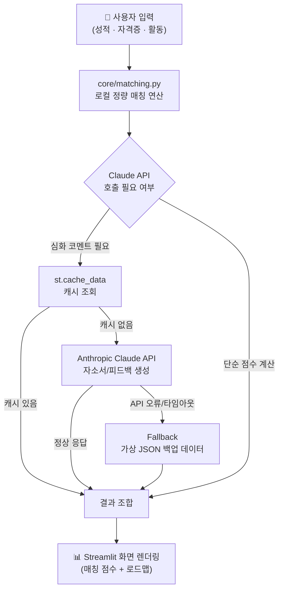

> **보관용 원문** — 2026-09-07 W3 과제로 README 에 제출했던 내용을 그대로 옮겨 둔 문서입니다
> (커밋 `ad66403`). 이후 코드가 바뀌어 **현재 동작과 다른 부분이 있습니다.**
> 예: 마스코트 출처 문구(5절)는 [팀 확인 필요], 화면 구성은 지금 README 를 기준으로 보세요.

# 3주차(W3) 기술 아키텍처 및 MVP 정의

## EMP팀 W3. 기술 아키텍처 및 MVP 정의

### 1.  MVP 범위 정의 

**핵심 행동 정의 (Core Action)**
> 마이스터고 학생이 성적과 자격증을 입력하면, 목표 기업에 대한 정량적 합격 매칭 점수(100점 만점)를 즉시 진단받는다.

이 한 문장이 검증하려는 가치는 "확신 없이 감으로 진로를 결정한다"는 핵심 문제 정의를 직접 겨냥합니다. 따라서 6주 개발 기간 동안 이 흐름(입력 → 매칭 점수 산출 → 즉시 피드백)을 가장 매끄럽게 완성하는 것을 최우선 순위로 두고, 그 외 기능은 아래 기준에 따라 과감히 쳐냈습니다.

| 구분 | 기능 | 상태 | 제외/포함 사유 |
|---|---|---|---|
| ✅ MVP (이번에 만듦) | 스펙 입력 폼 (성적·자격증·활동) | 구현 | 핵심 행동의 입력값. 없으면 매칭 자체가 성립 불가 |
| ✅ MVP | 정량적 합격 매칭 점수 진단 (100점 만점) | 구현 | 핵심 문제 정의를 직접 해결하는 유일한 기능 |
| ✅ MVP | 목표 기업별 합격 로드맵(부족 스펙) 제시 | 구현 | 점수 진단 이후 "그래서 뭘 해야 하는가"에 답하는 최소 후속 기능 |
| ✅ MVP | Claude API 기반 자소서 초안 코멘트 | 구현 | 매칭 결과를 실질적 행동(자소서 작성)으로 연결하는 데 필요 |
| ❌ Exclude | 소셜 로그인 (카카오/구글) | 향후 계획 | 메시지 앱에서 채팅은 핵심이지만 이모티콘은 최소 기능 검증에 필수적이지 않은 것처럼, 로그인은 '객관적 스펙 대조 기준 제공'이라는 핵심 가치 검증과 무관합니다. 세션 기반 임시 입력만으로 첫 검증에는 충분하다고 판단해 제외했습니다. |
| ❌ Exclude | 1:1 전문가 Q&A 매칭 | 향후 계획 | 사람 대 사람 매칭은 운영 리소스(전문가 섭외·스케줄링)가 별도로 필요한 기능으로, 앱 자체의 '정량 진단' 가치와는 독립적인 검증 항목입니다. 핵심 가설이 검증된 이후 확장할 영역으로 미뤘습니다. |
| ❌ Exclude | 학생 간 커뮤니티/게시판 | 향후 계획 | 커뮤니티는 사용자 수(네트워크 효과)가 어느 정도 확보된 이후에나 의미가 생기는 기능입니다. 초기 100명 규모 검증 단계에서는 오히려 개발 리소스를 핵심 매칭 로직에서 분산시키는 리스크가 더 크다고 판단했습니다. |
| ❌ Exclude | 기업 채용 담당자용 대시보드 | 향후 계획 | 우리 서비스의 1차 검증 대상은 '학생'이며, 기업 측 기능은 완전히 다른 사용자군을 위한 별도 제품 트랙입니다. MVP의 단일 행동 검증 원칙에 어긋나 제외했습니다. |

---

### 2. 보안 점검 결과 (API 비밀키 및 크레덴셜 격리 점검)

GitHub Public Repository로 운영되는 프로젝트 특성상, 비밀키 하드코딩 유출은 곧 예기치 못한 대규모 과금 및 데이터 오남용으로 직결될 수 있는 최우선 리스크로 규정하고 다음과 같이 점검·조치했습니다.

- **`secrets.toml` 기반 격리**: Claude API 연동에 필요한 `api_key`는 `app.py` 등 소스 코드 어디에도 하드코딩하지 않았습니다. Streamlit의 보안 환경변수 시스템(`st.secrets`)을 통해서만 런타임에 불러오도록 구성하여, 코드와 비밀키를 물리적으로 완전히 분리했습니다.
- **`.gitignore` 등록 및 커밋 이력 검증**: 로컬 개발 환경의 비밀 설정 파일(`.streamlit/secrets.toml`, `.env`)을 `.gitignore`에 등록하여 Git 추적 대상에서 원천 제외했습니다. 아울러 `git log --all --full-history -- "*.env" "*secrets.toml*"` 명령으로 과거 커밋 이력에 실수로라도 포함된 적이 없는지 교차 검증을 완료했습니다.
- **배포 환경 분리**: Streamlit Community Cloud 배포 시에는 리포지토리에 포함되지 않는 별도의 "Secrets" 설정 메뉴를 통해 운영용 API 키를 등록하여, 로컬/배포 환경 간 키 관리 체계를 이원화했습니다.

> ✅ 결론: 현재 Public 저장소 어디에도 실키(real key)가 노출되어 있지 않음을 확인했습니다.

---

### 3. 시스템 아키텍처 (데이터 흐름도)

사용자의 스펙 입력이 매칭 점수로 렌더링되기까지의 전체 파이프라인입니다. 외부 API 장애나 지연 상황에서도 서비스가 죽지 않도록 Fallback(가상 JSON 백업 데이터) 계층을 이중화한 것이 핵심입니다.



**텍스트 요약**
```
[스펙 입력] → [core/matching.py 로컬 연산] 
                    ├─(정상)→ [Claude API + st.cache_data 캐싱] → [결과 조합]
                    └─(API 실패)→ [Fallback JSON 백업 데이터] → [결과 조합]
                                            → [Streamlit 렌더링]
```

이 구조 덕분에 Claude API에 일시적 오류가 발생해도 사용자는 최소한의 매칭 결과를 즉시 받아볼 수 있고, `st.cache_data`로 동일 입력에 대한 반복 호출 비용도 절감했습니다.

---

### 4. AI 및 오픈소스 라이선스 명세

**사용 AI 도구**

| 도구 | 활용 목적 |
|---|---|
| Anthropic Claude (API) | 서비스 런타임 내 자소서 코멘트 생성 및 개발 과정의 코드 구현 어시스턴트 |
| Gemini (Notebook) | 기획 단계 검수 및 멘토 피드백 대응 자문 |

**사용 오픈소스 라이브러리 및 라이선스**

| 패키지 | 라이선스 | 용도 |
|---|---|---|
| Streamlit | Apache-2.0 | 웹 프론트엔드 및 배포 |
| pandas | BSD-3-Clause | 데이터 처리 및 매칭 연산 |
| reportlab | BSD | 로드맵 결과 PDF 리포트 생성 |

> 위 라이브러리는 모두 상업적 이용 및 재배포가 허용되는 라이선스이며, 본 프로젝트의 공모전 출품 및 Public 저장소 공개 방식과 충돌하지 않습니다.

5. 비주얼 에셋 및 이모지 출처 안내
현재 라이브 프로덕트에 적용된 마스코트 일러스트는 팀이 직접 디자인한 자체 제작 원본 파일이며, 로드맵 스탬프는 기본 이모지 에셋을 활용하였습니다.
공모전 규정에 따라, 본선(1차 통과 이후) 진출 시 네이버 OGQ 마켓의 정식 크리에이터 스티커 및 캐릭터 API를 공식 연계하여 고도화할 예정입니다.

---

## 🛠 W3 리팩토링 요약 

| 요구 | 파일 | 내용 |
|---|---|---|
| #1 정량 점수 공식 | `core/matching.py` | 내신 30 + 자격증 40 + 적합성 20 + 인재상 10 = 100점. 내신은 `30 × (5.0 − 등급) ÷ 4.0`, 자격증은 정확일치 100% / 유사자격 70% 인정비율의 평균 × 40점. **AI API 호출 없이 순수 파이썬 로컬 연산** |
| #2 예외처리·이중화 | `services/fallback.py` | 모든 외부 호출을 `safe_call()`로 감싸 예외를 흡수하고 `data/backup_master.json`(공고 34건·자격증 45종·강소기업 10건)으로 즉시 전환. 상단에 **[LIVE API] / [BACKUP DATA]** 컬러 배지 표출 |
| #3 비용 차단막 | `services/llm.py` | `@st.cache_data(ttl=3600)`로 동일 입력 재요청 시 API 재호출 차단. 키는 `st.secrets["CLAUDE_API_KEY"]`에서만 로드(하드코딩 없음) |
| #4 OGQ 인터랙션 | `data/ogq_assets.py`, `assets/ogq/` | 점수 80↑ 축하 / 50~79 격려 / 50↓ 위로 스티커 자동 전환. 로드맵 3단계 체크 시 스탬프 렌더링 |
| #5 The Cut | `app.py` 5번 탭 | 로그인·전문가 매칭을 MVP에서 제외한 이유와 '열림 조건'을 카드로 정리 |
